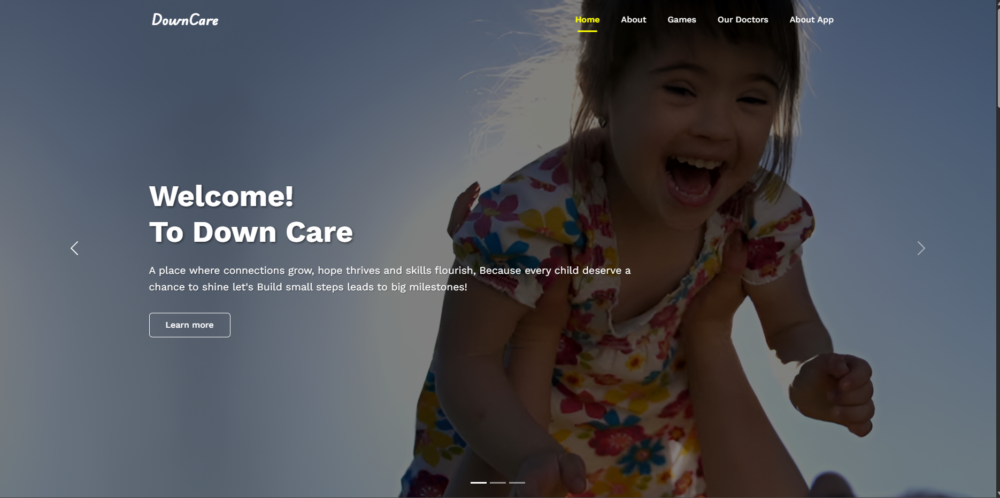
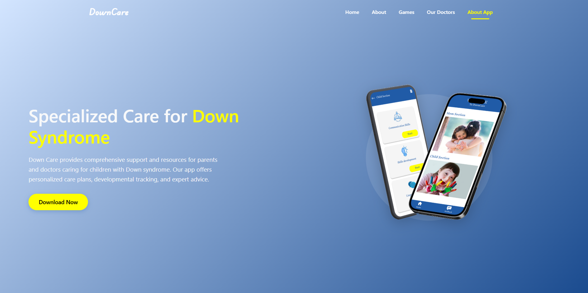
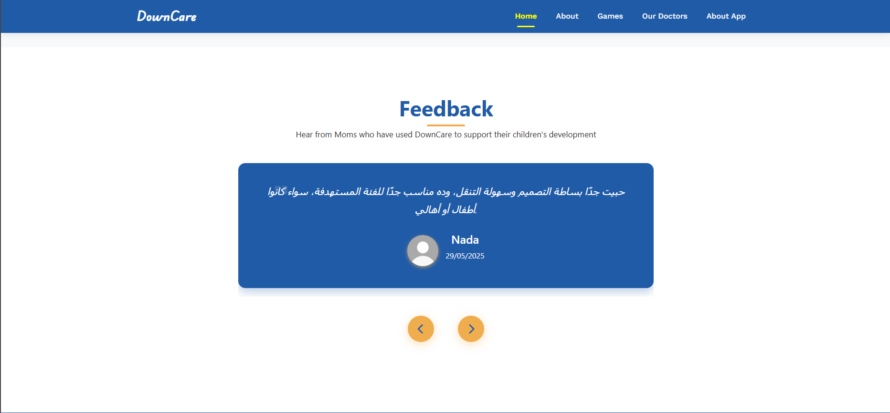

# 🌟 DownCare

**DownCare** is a graduation project designed to support **children with Down Syndrome** and their mothers.  
It provides developmental tools, progress tracking, doctor communication, and fun educational games — all in one platform.  

👉 **Live Website:** [DownCare Website](https://emann2.github.io/DownCare/index.html)

---

## 🎯 Project Idea

DownCare aims to make life easier for mothers raising children with Down Syndrome by offering:  

- 📱 **Mobile App (APK available on the website)** for daily use by mothers and children.  
- 🌐 **Website** to present the project and allow downloading the app.  
- ⚙️ **Backend (FastAPI)** to handle data, user authentication, and communication.  
- 🎮 **Unity-based Games** integrated into the app to help children learn and develop skills in a fun way.  

---

## 👩‍👩‍👦 Target Users

- **Mothers** → track their child’s progress, access personalized forms, and communicate with doctors.  
- **Children with Down Syndrome** → play tailored games that support skill-building.  
- **Doctors** → receive updates and provide feedback on child development.  

---

## ✨ Key Features

- 🔒 Secure login for mothers.  
- 📝 AI-powered personalized forms to track child development.  
- 🧩 Fun Unity games for children.  
- 📊 Progress tracking and insights for parents.  
- 💬 Direct communication channel with doctors.  

---

## 📸 Demo & Screenshots

Visit the live website to explore the project, download the app, and see more details:  
👉 [DownCare Website](https://emann2.github.io/DownCare/index.html)

### Screenshots

  
  
  

---

## 🛠 Tech Stack

- **Frontend (Website):** HTML, CSS, JavaScript  
- **Mobile App:** Flutter  
- **Backend:** ASP .NET (C#)  
- **Games:** Unity (C#)  
- **Database:** MySQL  

---

## 📌 Note

- This repository only contains the **Backend code**.  
- The **APK file** for the mobile app is available on the [Website](https://emann2.github.io/DownCare/index.html).  
- The website itself demonstrates the project idea and its impact.  
- 👉 You can check the backend code repository here: [DownCare Backend Repo](https://github.com/khaledsaad17/DownCare_backend)  

---
